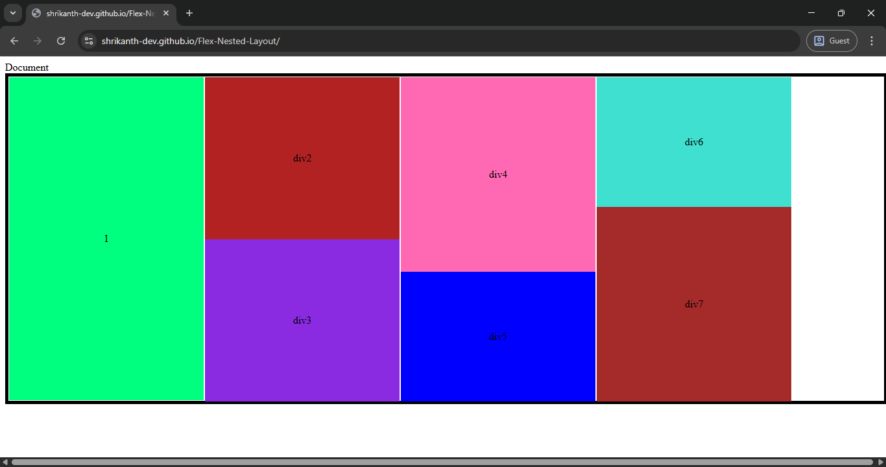

# Flexbox Nested Layout 

## Table of contents

- [Overview](#overview)
  - [The challenge](#the-challenge)
  - [Screenshot](#screenshot)
  - [Links](#links)
  - [Built with](#built-with)
- [Author](#author)

## Overview

A responsive HTML + CSS Flexbox project showcasing nested boxes with color differentiation and resizing across desktop and mobile views.

### The challenge

- Build a flex container with multiple nested boxes inside columns.
- Adjust the layout for smaller screens (max-width: 760px):

- Change main container to block layout.

- Inner boxes split into 50% widths while maintaining heights.
- Practice Flexbox centering and alignment for learning structured responsive design.

### Screenshot

### Links

- Solution URL: [solution URL](https://github.com/shrikanth-dev/Flex-Nested-Layout)
- Live Site URL: [live site URL](https://shrikanth-dev.github.io/Flex-Nested-Layout/)

### Built with

-HTML5

-CSS3 (Flexbox, Media Queries)

## Author

- Frontend Mentor - [@shrikanth-dev]
- LinkedIn - [@G Srikanth](https://www.linkedin.com/in/g-srikanth-gs)
